# FLUTTER SAMPLES

## APPS CLONE
## 01 - BOOK STORE APP DESIGN CONCEPT
- ### [INSPIRATION](https://dribbble.com/shots/15710947-Book-Store-App-Design-Concept) 

<TABLE BORDER>
    <TR>
        <TH style="text-align:center">SLIDE SHOW</TH>
        <TH style="text-align:center">HOME</TH>
        <TH style="text-align:center">DETAIL</TH>
	<TR>
		<TD>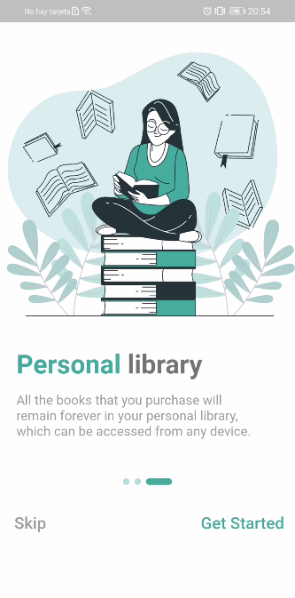</TD>
		<TD>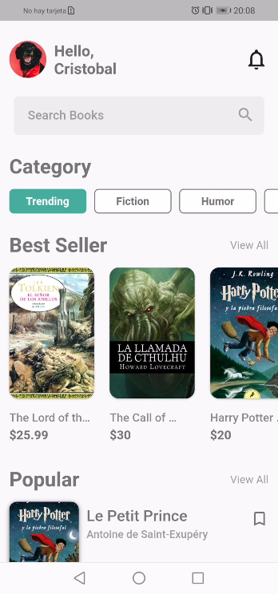</TD>
        <TD>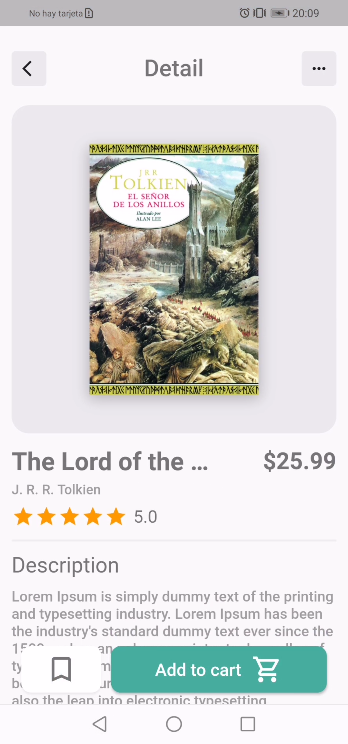</TD>
	</TR>
</TABLE>

## 02 - PLANT SHOP
- ### [INSPIRATION](https://dribbble.com/shots/15713910--Pot-it-Plant-Shop-App) 

<TABLE BORDER>
    <TR>
        <TH style="text-align:center">HOME</TH>
        <TH style="text-align:center">DETAIL</TH>
	<TR>
		<TD>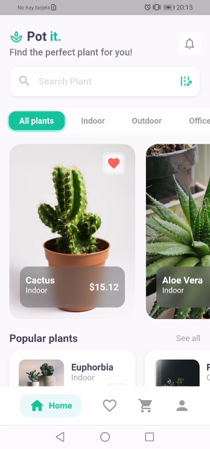</TD> 
        <TD>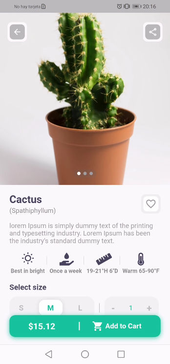</TD>
	</TR>
</TABLE>

## 03 - SHOES STORE APP
- ### [INSPIRATION](https://dribbble.com/shots/6733935-Bright-App-UI-Kit) 

<TABLE BORDER>
    <TR>
        <TH style="text-align:center">SHOES STORE</TH>
	<TR>
		<TD></TD> 
	</TR>
</TABLE>

## 04 - COOKFINDER APP
- ### [INSPIRATION](https://dribbble.com/shots/14513232-The-cookfinder-app-interaction) 

<TABLE BORDER>
    <TR>
        <TH style="text-align:center">COOKFINDER</TH>
	<TR>
		<TD></TD> 
	</TR>
</TABLE>

## 05 - RENT APP
- ### [INSPIRATION](https://dribbble.com/shots/15973955-Home-Rent-App) 

<TABLE BORDER>
    <TR>
        <TH style="text-align:center">HOME</TH>
        <TH style="text-align:center">HOME MENU</TH>
        <TH style="text-align:center">DETAIL</TH>
	<TR>
		<TD>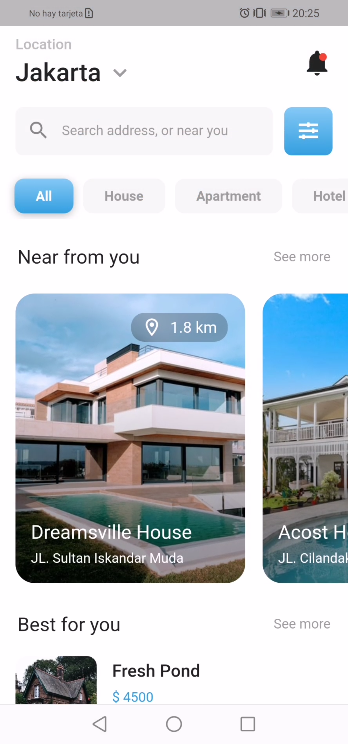</TD> 
        <TD>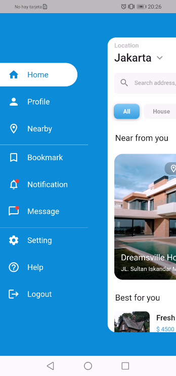</TD>
        <TD>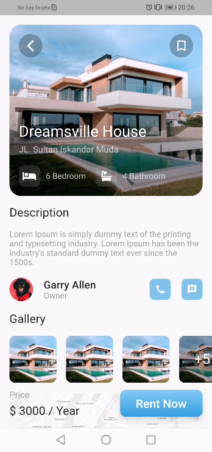</TD> 
	</TR>
</TABLE>

## 06 - WHATSAPP REDESIGN
- ### [INSPIRATION](https://dribbble.com/shots/15990476-Whatsapp-Redesign-Concept) 

## LIGHT MODE WITH FLUTTER
<TABLE BORDER>
    <TR>
        <TH style="text-align:center">CHAT LIGHT</TH>
        <TH style="text-align:center">GROUPS LIGHT</TH>
        <TH style="text-align:center">CALLS LIGHT</TH>
    </TR>
	<TR>
		<TD>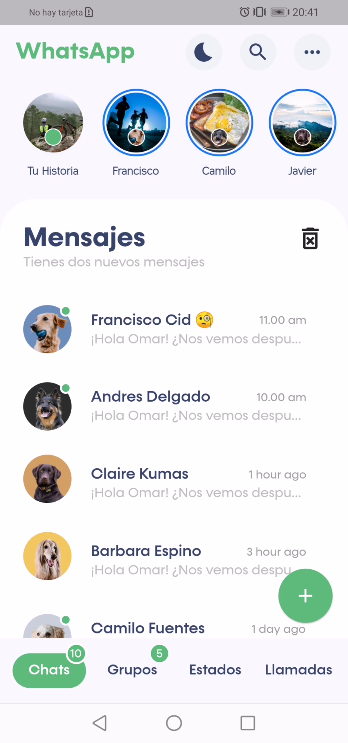</TD> 
        <TD>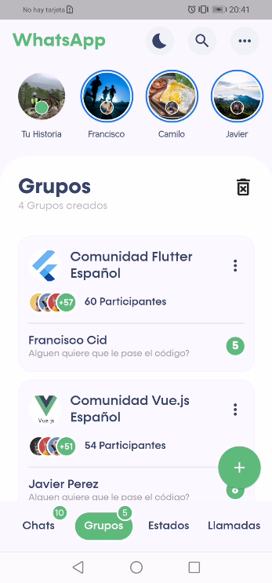</TD> 
        <TD>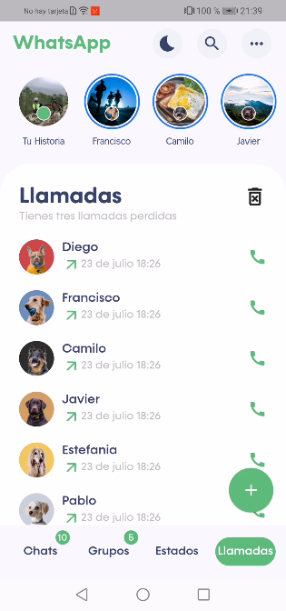</TD>
	</TR>
</TABLE>

## DARK MODE WITH FLUTTER
<TABLE BORDER>
    <TR>
        <TH style="text-align:center">CHAT DARK</TH>
        <TH style="text-align:center">GROUPS DARK</TH>
        <TH style="text-align:center">CALLS DARK</TH>
    </TR>
	<TR>
		<TD>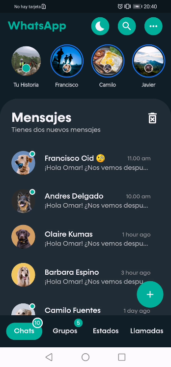</TD> 
        <TD>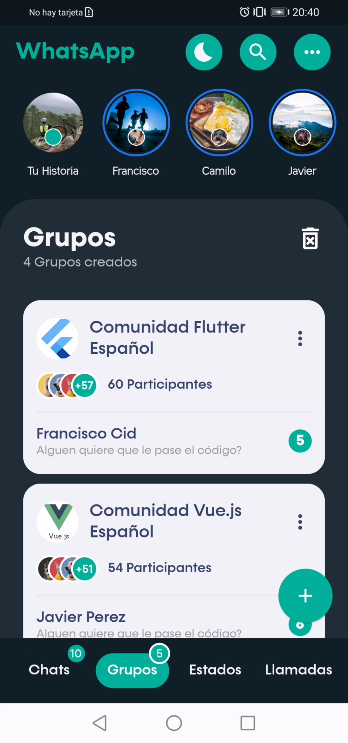</TD> 
        <TD>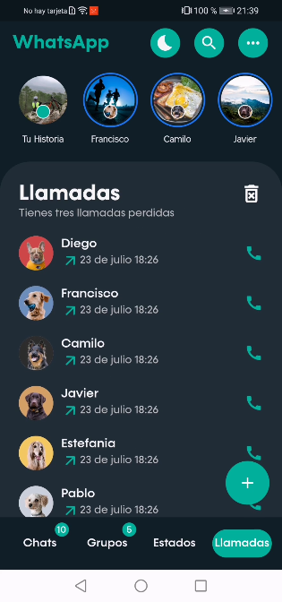</TD> 
	</TR>
</TABLE>

## CHAT AND ALERT

<TABLE BORDER>
    <TR>
        <TH style="text-align:center">CHAT</TH>
        <TH style="text-align:center">ALERT</TH>
    </TR>
	<TR>
		<TD></TD> 
        <TD></TD> 
	</TR>
</TABLE>

## 07 - COFFEE SHOP APP
- ### [INSPIRATION](https://dribbble.com/shots/15977736-Coffee-Shop-App-Concept-Design) 

<TABLE BORDER>
    <TR>
        <TH style="text-align:center">COFFEE SHOP</TH>
	<TR>
		<TD></TD> 
	</TR>
</TABLE>